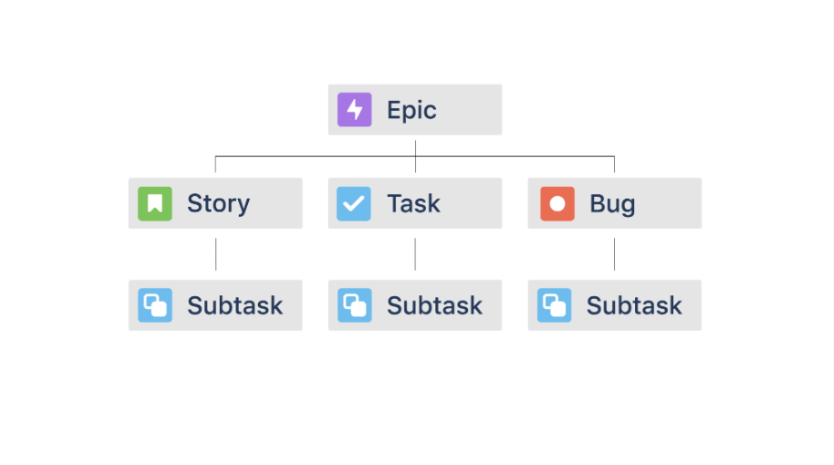

# Fundamentos do Jira Software

## Primeiros passos com o Jira Software

### O que é o Jira Software?

- Pense no Jira Software como uma lista de tarefas para toda a equipe. Ele ajuda todos em sua equipe a planejar, rastrear e enviar produtos de classe mundial. É o produto Jira mais popular.

- Usuários tem as seguintes permissões:

    ✔ Atualizar os itens de trabalho atribuídos
    ✔ Compartilhar o progresso com a equipe
    ✔ Visualizar o progresso da equipe no trabalho e fornecer feedback

- Adminsitradores tem as seguintes permissões:

    ✔ Configurar layouts, recursos ou permissões do Jira para uma equipe
    ✔ Planejar recursos com base na largura de banda
    ✔  Priorizar problemas em projetos
    ✔ Criar relatórios para monitorar o desempenho da equipe

### Termos básicos do Jira Software

- Itens de trabalho individuais são chamados de problemas(issues).

- Um  projeto  é uma coleção de problemas(issues).

- Um  quadro  é uma exibição visual do progresso do trabalho.

    -  Os quadros Kanban  são usados ​​por todos os tipos de equipes. Eles ilustram um fluxo contínuo de trabalho. As questões entram e saem continuamente do quadro desde o início do projeto até o final do projeto.

    -  Os quadros Scrum  são usados ​​principalmente por equipes ágeis de desenvolvimento de software. Os quadros Scrum trazem grupos de questões que a equipe tentará concluir durante um período fixo de tempo, geralmente um “sprint” de duas semanas. Após a conclusão de um sprint, um novo quadro scrum é criado para o próximo lote de problemas do projeto.

### Comece a navegar no Jira Software

- Na parte superior da tela, a  barra de navegação principal   ajuda você a encontrar seu trabalho, projetos e colegas de equipe. Ele também permite que você crie problemas, procure trabalho e ajuste suas configurações.

- À esquerda da tela, a  barra lateral do projeto  é uma barra de navegação recolhível que mostra opções específicas do projeto que você está visualizando.

- Menu principal:

        - Alternador de produto:  permite que você mude para outros produtos Atlassian que sua equipe possa estar usando, como Confluence ou Bitbucket.

        - Seu trabalho : mostra problemas, projetos e quadros que você visitou recentemente e permite visualizar todos os trabalhos atribuídos a você.

        - Projetos:  mostra uma lista de todos os seus projetos e permite criar novos projetos.

        - Filtros e painéis:  mostra filtros e painéis salvos ou marcados com estrela.

        - Pessoas: mostra uma lista das pessoas e equipes com as quais você mais interage.

        - Planos, ativos e aplicativos: permite que você veja seus planos e aplicativos instalados na sua instância do Jira (somente para usuários Premium).

        - Criar: permite criar rapidamente novos problemas.

        - Pesquisa:  ajuda você a encontrar problemas, projetos, quadros, filas, filtros e pessoas.

        - Configurações e perfil: permite que você personalize suas configurações pessoais, configure seu perfil e controle notificações por e-mail.

- Menu lateral:
    
        - Nome do projeto:  Mostra o projeto atual em que você está.

        - Comutador de placas : permite alternar entre diferentes placas neste projeto.

        - Backlog:  Mostra uma lista de pendências que ainda não foram iniciadas. Dependendo das suas configurações, o backlog também pode conter alguns problemas atualmente no quadro.

        - Visualização do quadro:  traz para você uma visualização do quadro selecionado.

        - Relatórios: mostra todos os relatórios disponíveis que você pode criar.

        - Opções do menu inferior: O botão Problemas mostra todos os problemas do projeto. Os botões das páginas Componentes , Versões e Projeto são recursos mais avançados do Jira. Verifique com seu administrador do JIRA se você precisa saber mais sobre isso.

        - Configurações do projeto: talvez você não consiga ver esta opção. É usado principalmente por administradores e gerentes de projeto do Jira para editar detalhes do projeto, atualizar permissões e criar fluxos de trabalho.

        - Indicador de tipo de projeto: os projetos Jira podem ser gerenciados por equipe ou pela empresa. A funcionalidade principal desses tipos de projeto é a mesma, mas você pode encontrar algumas diferenças com base no tipo de projeto.

### Usando quadros ágeis no Jira Software

- Os quadros do Jira são ágeis porque oferecem uma maneira visual de visualizar rapidamente um conjunto de problemas e seu status  . As diferentes colunas de status em um quadro representam juntas o fluxo de trabalho do seu quadro. Um fluxo de trabalho  é o caminho dos status pelos quais um problema passará do início ao fim. Um exemplo de fluxo de trabalho simples é um problema que passa de A fazer para Em andamento  e para Concluído.

## Gerenciando seu trabalho no Jira Software

### Noções básicas de problemas(issues) no Jira Software

,
- Campos de um problema(issue):

    - A chave do problema  é um identificador exclusivo fornecido para cada problema. As chaves de problema contêm a chave do projeto e um número sequencial. No exemplo abaixo, a chave do problema é GD-8. À esquerda da chave do problema há um pequeno ícone. Este ícone indica o tipo de problema. Você aprenderá mais sobre os tipos de problemas abaixo.   Por que este campo é importante? A chave do problema ajuda você a encontrar problemas ou encaminhar para trabalhar com seus colegas de equipe.

    - O resumo  é o título ou nome abreviado do problema. Por que este campo é importante? O resumo ajuda você a reconhecer rapidamente o problema. Ele aparece no cartão de emissão como o nome do problema.  

    - A descrição  é um local para adicionar detalhes de apoio sobre o problema. Por que este campo é importante? A descrição ajuda você a explicar e compreender melhor um problema. 

    - A data de vencimento  é a data em que este problema deve ser concluído. Por que este campo é importante? Prestar atenção às datas de vencimento das emissões ajudará você a priorizar o trabalho e planejar as próximas semanas. 

    - Os campos responsável e relator  mostram as pessoas associadas ao problema. O cessionário é a pessoa designada para trabalhar no problema. O repórter é a pessoa que criou o problema. Por que esses campos são importantes? Se você tiver alguma dúvida sobre um problema, os campos responsável e relator informam qual colega de equipe entrar em contato.  

    - Os rótulos   permitem categorizar os problemas. Você pode usar vários rótulos para rastrear informações diferentes sobre um item de trabalho. Por que este campo é importante? Você pode usar rótulos para agrupar problemas, como adicionar um rótulo "Marketing" a todo o trabalho relacionado a marketing ou adicionar "atualização de produto" para acompanhar todas as atualizações feitas por sua equipe.

- Tipos de problemas (issues):

    - Épico: é uma grande iniciativa. Conhecidos como problemas "pais", os épicos contêm problemas menores. Freqüentemente, representam grandes volumes de trabalho que podem ser divididos em tarefas menores. 

    - História: é um recurso ou requisito da perspectiva do usuário. Histórias são comumente usadas por equipes de desenvolvimento de software. Eles definem itens de trabalho em linguagem não técnica. Por exemplo, “Como usuário, preciso de um botão Voltar nesta tela”. As histórias estão no mesmo nível hierárquico das tarefas, e algumas equipes usam os dois tipos de problemas de forma intercambiável.

    - Erro(Bug): descreve um problema ou erro, usado principalmente em equipes de desenvolvimento de software. Eles podem existir dentro de um épico maior ou por conta própria.

    - Tarefa(Task): é o tipo de problema mais comum. Eles contêm uma descrição mais detalhada de um item de trabalho. As tarefas podem existir dentro de um épico maior ou sozinhas.

    - Subtarefa(Subtask) é um problema mais definido, usado para dividir tarefas, histórias ou bugs em itens de trabalho menores. As subtarefas devem ter um tipo de problema pai. Eles não podem existir por conta própria.

    

### Criação de novos problemas no Jira Software

- Cada problema pode ser criado e clonado com alguns campos preenchidos.

### Atualizando problemas no Jira Software

- Na atividade alguns campos são demonstrados num problema (issue):

    - Comentários: Comentários realizados naquele problema(issue)

    - Histórico: mostra todas as alterações em um problema e qual usuário as fez

    - Registro de trabalho: Resumo das atividades registradas nos campos desse problema(issue)

- A vinculação serve para:

    - mostrar relações entre problemas e navegar até eles

    - navegar até as páginas relacionadas do Confluence a partir do problema

    - navegar para outros recursos da web relacionados ao problema

### Colaborar em problemas no Jira Software

- Comentários:

    - mencione colegas de equipe com @-ing para chamar a atenção para informações importantes

    - adicione uma chave de problema em um comentário para fornecer um link para outro problema

    - adicione imagens nos comentários para mais informações

    - obter um link para um comentário específico para compartilhar em outro lugar

    - classificar comentários em ordem crescente ou decrescente

    - adicionar reações a comentários com emojis populares como 👍 ou 🔥

- Fique por dentro ativando 'Observe seus problemas'.

    - Com essa configuração, você automaticamente se torna um observador  de qualquer problema com o qual interage. Isso significa que você receberá notificações sempre que houver uma atualização do problema

## Práticas recomendadas do Jira para iniciantes

### Construindo seu hábito diário do Jira

- Práticas diárias:

    - Mantenha o Jira Software sempre aberto

    - Comece seu dia de trabalho com Jira Software

    - Comprometa-se com uma sequência de 30 dias do Jira Software

    - Seja o campeão do Jira Software em sua equipe

    - Otimize o software Jira para você

### Emitir práticas recomendadas no Jira Software

- Práticas que te ajudam a trabalhar com o Jira Software:

    - Procure problemas que você não consegue encontrar (use a barra de pesquisa)

    - Marque quadros, projetos e filtros importantes com estrela

    - Você pode votar  em questões para mostrar que considera uma questão importante

    - Acompanhe o tempo que você leva para trabalhar nos problemas

    - Fixe os campos que você usa com frequência

### Criação de painéis básicos no Jira Software

- Use painéis para acompanhar o que você precisa.

    - Um painel  é uma tela personalizada que fornece um instantâneo de alto nível de tudo o que acontece no Jira. Os painéis são compostos de pequenos blocos configuráveis ​​chamados  gadgets

        - Alguns exemplos de Gadgets: Atribuído a mim, Estatísticas do problema e Estatísticas de filtro bidimensional

### Trabalhar com eficiência usando comandos no Jira Software

- Para localizar os atalhos de teclado do Jira Software, utilize o "?" e ele abrirá a lista de atalhos de teclado.

- Os comandos são separados por:

    - Atalhos Globais: Estes atalhos podem ser usados ​​quando você estiver em qualquer parte do Jira.
    - Problemas de Navegação: Use estes atalhos para navegar pelos problemas(issues).
    - Emitir Ações: Esta seção possui atalhos para trabalhar com problemas(issues).
    - Ações do Conselho: Esses atalhos ajudam você a navegar rapidamente pelos quadros.

- Use a paleta de comandos para trabalhar no Jira apenas com o teclado:

    - Pressione Command + K no Mac ou Ctrl + K no Windows

### Atualizando suas configurações pessoais no Jira Software

- No menu de configurações pessoasi é possível personalizar os seguintes campos:

    - Seu fuso horário:  defina suas preferências de data e fuso horário.

    - Idioma:  altere seu idioma preferido.

    - Observe seus problemas:  torne-se automaticamente um observador de qualquer problema que você criar ou comentar.

    - Sua página inicial do Jira:  escolha sua página inicial preferida. Ao clicar no logotipo do Jira no canto superior esquerdo, você será direcionado para a página selecionada.
    
    - Preferências de notificação por email:  escolha como e quando você receberá notificações por email.